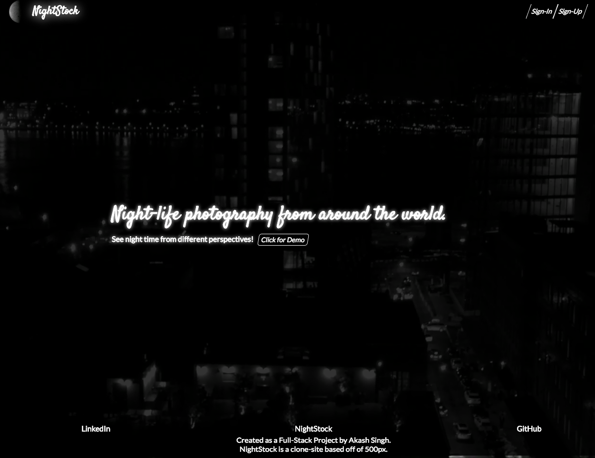
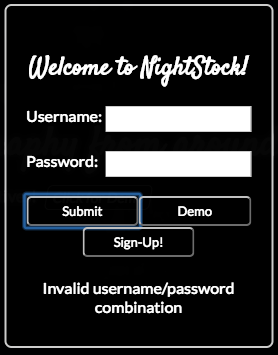
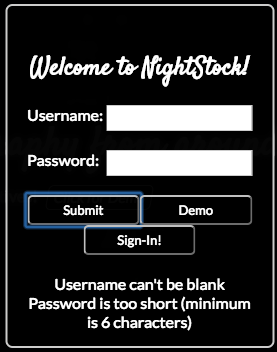
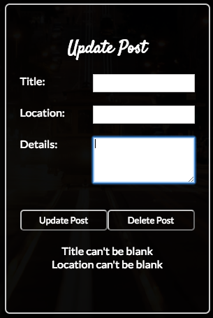

# NightStock: Production

[NightStock live][heroku]

[heroku]: http://nightstock.herokuapp.com/#/

NightStock is a full-stack web application inspired by 500px.  It utilizes Ruby on Rails on the backend, a PostgreSQL database, and React.js with a Redux architectural framework on the frontend via ES6.




## Features & Implementation

### React Wonder
NightStock is truly a single-page, React-based web application, partly due to the way it passes <tt> state and store </tt> with an abundance of information to continually feed the front-end components. Additionally, the combination of front-end and backend provides an effective, but easy user interface without errors.

```js
{
  errors: [],
  postDetail: {
    description: "post description",
    id: "post's id",
    image_url: "post.com/post",
    location: "post, post, usa",
    title: "post title",
    user: {
      user_id: "poster's id",
      user_image_url: "poster.com/poster",
      username: "poster's username"
    }
  },
  posts: {
    0: {
      description: "post description",
      id: "post's id",
      image_url: "post.com/post",
      location: "post, post, usa",
      title: "post title",
      user: {
        user_id: "poster's id",
        user_image_url: "poster.com/poster",
        username: "poster's username"
      }
    },
    1: {
      ...
    }
  },
  session: {
    currentUser: {
      cover_photo_url: "cover.com/cover",
      description: "currentUser's description",
      followees: [
        0: "ID of a user that userDetail is following",
        1: ...
      ],
      followers: [
        0: "ID of a user following userDetail",
        1: ...
      ],
      id: "currentUser's id",
      posts : [
        0: {
          description: "post description",
          id: "post's id",
          image_url: "post.com/post",
          location: "post, post, usa",
          title: "post title",
          user: {
            user_id: "poster's id",
            user_image_url: "poster.com/poster",
            username: "poster's username"
          }
        },
        1: {
          ...
        }
      ]
    }
  }
  userDetail: {
    cover_photo_url: "cover.com/cover",
    description: "currentUser's description",
    followees: [
      0: "ID of a user that userDetail is following",
      1: ...
    ],
    followers: [
      0: "ID of a user following userDetail",
      1: ...
    ],
    id: "currentUser's id",
    posts : [
      0: {
        description: "post description",
        id: "post's id",
        image_url: "post.com/post",
        location: "post, post, usa",
        title: "post title",
        user: {
          user_id: "poster's id",
          user_image_url: "poster.com/poster",
          username: "poster's username"
        }
      },
      1: {
        ...
      }
    ]
  }
}
```


### User Authorization
Throughout the site, the session controller will manage the User's authorization only allowing certain actions if there is a current user. Signing in, up, and out of the site is allowed by an modal interaction. Post sign-in, a user will always have access to signing out of the site from the navbar. Errors in either signing in or up will be displayed at the bottom of the modal.





### Profile Page and Follows
NightStock's profile page serves as a user hub. Customization is reliant on the backend passing information such as <tt> current_user posts, description, interaction, cover_photo, user_img, and other </tt> necessary information. This makes each page different than the last. Primarily using the same views, different cuts of information is typically used in the user show pages. From the sample state, the backend provides information via a route to the selected user. From there, the front end uses the userDetail portion of the sample state to render the proper information regarding the selected user. Each page presents the various information about the selected user, along with their created posts organized via a Masonry table from most recent to their primary post. A user's page is the effective inlet for a user to follow or unfollow a viewed user.


### Post CRUD (Create/Read/Update/Delete)
Post interaction is simplistic, yet effective. <tt>Posts can be created via a modal available on any part of the page from the navigation bar. An event click handler will allow for the current user to generate a post, while using the CloudinaryAPI to host the image.</tt> Errors for each form will be displayed on the bottom of the modal.





The posts' themselves will be rendered on an individual show page, or via a masonry table for the homefeed. Only the post creator can edit or delete the post via dispatched methods attached to the properties being passed to the respective component. The validations in the backend will prevent a user from creating or updating a post with a null <tt>title, location, or image_url</tt> in the case of the image url being sent from the CloudinaryAPI once an image is uploaded to the form via the React-DropZone component.


### Home Feed
The Home Feed page and its relative containers serve as the backdrop for cross-user interaction. Users can scroll via a Masonry table to access more followed material of users which are followed. Again, the most recent image will be provided on the upper parts of the page, while older posts will be followed. All of this will be based on the <tt> post id </id>, therefore removing the necessity to deal with dates or upload times.


## Future Directions for the Project

In addition to the features already implemented, I plan to continue work on this project.  The next steps for NightStock are outlined below. Again, the backend ties together various sources of information to seamlessly generate content as a user continues to browse.

### Discover new content

Overall, the Home Feed of a user focuses on users which are being followed at the moment. Therefore, to allow for a user to discover additional content, a discover page/container will be created that allows a user to scroll through content other than what they are following.

### Search by location

Although not a basic feature of 500px, I plan to create a unique discover page based off of a combination of search via posts based on location, and render those specific locations to a Google map. All under the premise to entice users to find desired night time activities around their location, and potentially add more posts to the site following suit of a desired location for content.

### Cross-User Interaction

Just like 500px, I plan to introduce a commenting functionality to NightStock. In turn, promoting cross-user interaction be enabling the sharing of additional information, ultimately in the hopes of additional content generation for NightStock.

### APIs
- Cloudinary
- Bonus: GoogleMapsAPI

### React Libraries
- React-DropZone
- React-Modal
- Masonry
