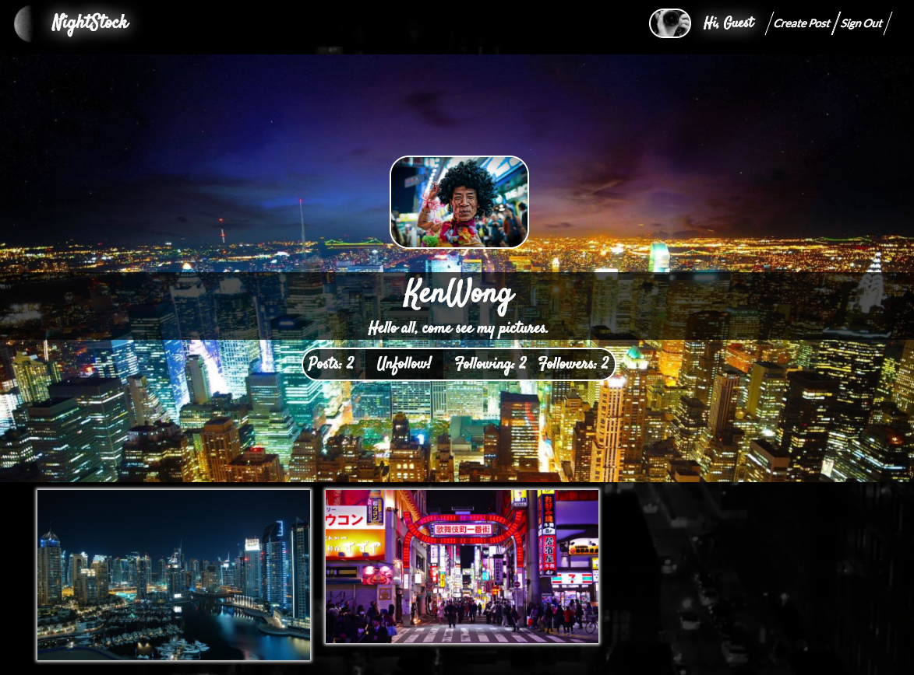
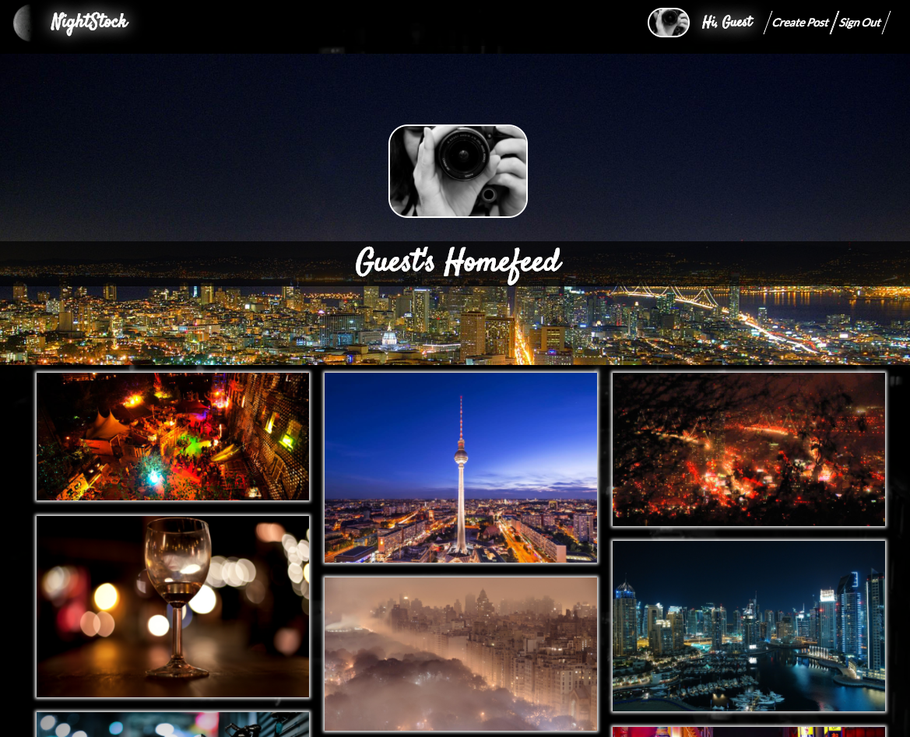

# NightStock

[NightStock live][heroku]

[heroku]: http://nightstock.herokuapp.com/#/

NightStock is a full-stack web application inspired by 500px.  It utilizes Ruby on Rails on the backend, a PostgreSQL database, and React.js with a Redux architectural framework on the frontend via ES6.

## Features & Implementation

### React Wonder
NightStock is truly a single-page, React-based web application, partly due to the way it passes <tt> state and store </tt> with selective information. Additionally, the combination of front-end and backend provides an effective, but easy user interface without errors.

```js
{
  currentUser: {
    id: 1,
    username: "guest"
  },
  posts: {
    1: {
      title: "Sample State",
      description: "Is good to plan",
      user_id: 1,
      location: "San Francisco",
      tags: {
        1: {
          id: 1,
          name: "Cold"
        }
      }
    }
  },
  postDetail: {
    1: {
      title: "Sample State",
      user_id: 1,
      tags: {
        1: {
          id: 1,
          name: "Cold"
        }
      }
    }
  },
  userDetail: {
    id: 1,
    username: "Guest",
    description: "Sample Description"
  }
  tagFilters: [1, 7, 14] // Used to track selected Tags for filtering of posts
}
```

### Profile Page
NightStock's profile page serves as a user hub. Customization is reliant on the backend passing information such as <tt> current_user posts, description, interaction, cover_photo, user_img, and other </tt> necessary information. This makes each page different than the last.




### Post CRUD (Create/Read/Update/Delete)
Post interaction is simplistic, yet effective. To promote user interaction, posts will allow for users to follow and comment, allowing for notification feeds. All of this is possible due to the backend database managing <tt>post description, title, user comments, follows, and other</tt> relevant information to generate each individual post modal.


### Home Feed & Follows
The Home Feed page and its relative containers serve as the backdrop for cross-user interaction. Users can follow other users, while infinitely scrolling to access more followed material.




## Future Directions for the Project

In addition to the features already implemented, I plan to continue work on this project.  The next steps for NightStock are outlined below. Again, the backend ties together various sources of information to seamlessly generate content as a user continues to browse.

### Search by location

Although not a basic feature of 500px, I plan to create a unique discover page based off of a combination of search via posts based on location, and render those specific locations to a Google map. All under the premise to entice users to find relevant night life activities around their location, and potentially add more posts to the site following suit of a desired location for content.

### Cross-User Interaction

Just like 500px, I plan to introduce a commenting functionality to NightStock. In turn, promoting cross-user interaction be enabling the sharing of additional information, ultimately in the hopes of additional content generation for NightStock.

### APIs
- Cloudinary
- Bonus: GoogleMapsAPI
